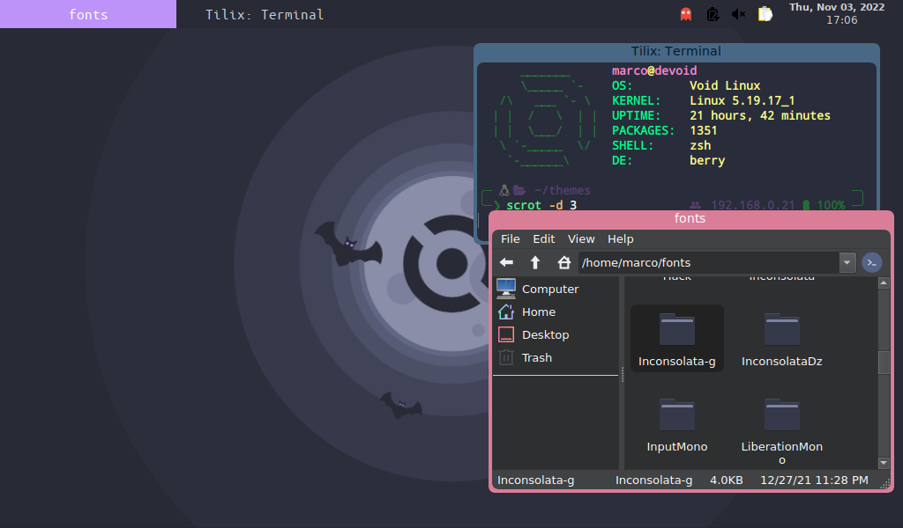

## Dracula for [BerryWM](https://berrywm.org/)

> A dark theme for [BerryWM](https://berrywm.org/).

## Install 3

All instructions can be found at [draculatheme.com/foobar](https://draculatheme.com/foobar).

Script biteme.sh to try the theme on the fly ... a bat's fly.

If you like it follow installation instruction.

Do not forget to make also other pieces of your berry home dracula style, in the screenshot:

tilix terminal --> dracula link

tint2 bar --> dracula link

QT5 for QT apps --dracula link

GTK for GTK apps + icons --> dracula link

zsh shell --> dracula link

ufetch --> link github

wallpaper --> dracula lin

and many more

midnight commander

notepadqq

ranger

DoomEmacs

dunst

firefox

rofi

....

## Team

This theme is maintained by the following person(s) and a bunch of [awesome contributors](https://github.com/dracula/foobar/graphs/contributors).

| [[M4lin]](https://github.com/m4lin) |
| ---------------------------------------------------------------------------------------- |
| [M4lin](https://github.com/m4lin)                                               |

## Community

- [Twitter](https://twitter.com/draculatheme) - Best for getting updates about themes and new stuff.
- [GitHub](https://github.com/dracula/dracula-theme/discussions) - Best for asking questions and discussing issues.
- [Discord](https://draculatheme.com/discord-invite) - Best for hanging out with the community.

## License

[MIT License](./LICENSE)ICENSE)
